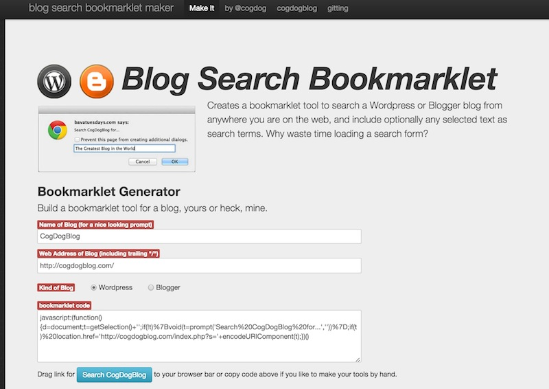

# Blog Search Bookmarklet Generator
by Alan Levine http://cog.dog/ or http://cogdogblog.com/

## What is this?
Your own blog has a lot of things written, right? If not go back to facebook and update your status. If you do have stuff in your blog history, but cannot remember it all, finding your classic posts usually means clicking your site, typing in words to a search form, and then pawing through the results.

But often you are "out there" in web space, reading things that make your memory trigger something that you may have already written about-- this tool offers a quick and easy way to search your blog from anywhere you are on the web -- even using as search terms text highlighted in a page.

This version can work for any Wordpress blog (self hosted or on Wordpress.com) or any Blogger blog.

## Making Your Own Bookmarklet
Head over to the Generator at http://cogdog.github.io/blog-search-maker/

You will want to enter the name of your blog (it is used in the search dialog box, that's all). When you click out of this entry field, you should notice the name on the blue button change to match your entry. That's rather amazing, huh?

Then enter your blog URL in the next box.  The most important thing is to make sure the URL ends in a trailing "/" (until I can get my code worked out to check for that, lazy me).

Now, you just drag this blue button (it's just a link) to an empty area on your web browser's bookmarks bar (that is what it's called in Chrome and Firefox; it is the Favorites bar in Internet Explorer and Safari).

## Using the Bookmarklet

Now let's say I am reading a post on some random blog... like http://bavatuesdays.com I might see a word like `selfie` that makes me think of something I wrote on my own blog. So if I just click the bookmarklet, it gives me a box where I can enter my search terms.

And boom! I can run a search just like that from my own blog!

That is one way to search, putting in words directly. But I also may see a phrase in said random blog that I would like to search on, maybe I have something about `John Wayne` written in my own blog that I want to reference when making a copy in someone else's blog.

Now when I click my bookmark, it runs the search on that highlighted phrase.

And look at this, I could have made another tool to search my Blogger blog. Same thing, I can do search box query just from clicking the tool, or I could highlight a phrase:

then click the bookmarklet, and here are the results from my Blogger site:

## Notes

* This is an updated version of [a similar tool I built in 2005](http://cogdogblog.com/code/wp_search_maker.php) which I have used frequently since then. I wanted to move the maker tool to github and experiment with an option to work on Blogger.  Ideally it could work on any search site if the search query URL has a regular structure

